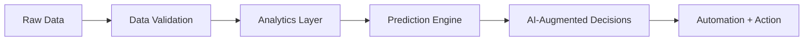

<div align="center">

<!-- 🖤 Minimal Dark Header -->


<br>

<!-- 💻 Subtle Typing Animation -->


<br><br>

<!-- ⚫ Clean Divider -->


</div>

<div align="center">


</div>

## Who I Am

I build modern AI-driven solutions that turn complexity into clear, usable systems. My focus is not just on writing code or creating dashboards, but on designing intelligent products that help people make faster decisions, automate heavy workflows, and unlock real business value from data.

I’m especially interested in the space where AI, analytics, and engineering meet, where models, automation, and product thinking come together to create systems that are practical, scalable, and genuinely impactful.
## Neural Intro

## What I Build
I build intelligent systems that connect data, automation, analytics, and AI into solutions that are useful in the real world. I care about more than models or dashboards in isolation. My focus is on creating systems that detect patterns, reduce friction, improve decisions, and turn complexity into action.

- AI-assisted products and workflows that reduce manual effort and improve decision-making
- Data systems that transform raw information into insight, action, and measurable outcomes
- Forecasting, reporting, and analytics solutions with a strong product and business mindset
- Clean, scalable solutions that feel modern, intelligent, and built for real use
The kind of work that excites me sits between AI engineering, decision systems, and product thinking: forecasting engines, AI-assisted workflows, analytics products, and automation layers that help teams move faster with more clarity.

## Engineering Mindset
## Operating Principles

```text
signal > noise
systems > scripts
impact > activity
automation > repetition
intelligence > static reporting
build for impact
design for scale
automate the repetitive
surface the signal
make intelligence usable
```

## Focus Areas
## Mission Control

<table>
  <tr>
    <td width="33%" valign="top">
      <h3>AI Solutions</h3>
      <p>Building practical AI workflows, LLM-assisted tools, and intelligent systems that solve real operational and product problems.</p>
    <td width="50%" valign="top">
      <h3>What I'm Building</h3>
      <p>AI-driven solutions, analytics products, forecasting systems, automation workflows, and decision-support tools that solve meaningful operational and business problems.</p>
    </td>
    <td width="33%" valign="top">
      <h3>Data + Analytics</h3>
      <p>Designing reliable pipelines, reporting layers, and analytical products that convert raw data into clarity and action.</p>
    </td>
    <td width="33%" valign="top">
      <h3>Automation</h3>
      <p>Creating solutions that remove friction, reduce repetitive work, and help teams move with more speed and confidence.</p>
    <td width="50%" valign="top">
      <h3>What I'm Optimizing For</h3>
      <p>Clear thinking, strong system design, elegant automation, measurable outcomes, and products that feel intelligent rather than just technically complex.</p>
    </td>
  </tr>
</table>

## AI System Map



## Focus Domains

### Intelligent Analytics
I work on analytics that go beyond reporting. The goal is to build systems that explain what happened, detect what matters, and help predict what comes next.

### AI-Augmented Workflows
I’m interested in how AI can upgrade everyday operations by reducing manual work, improving speed, and adding intelligence directly into business processes.

### Decision Engineering
The strongest systems do not just visualize data. They guide action. I like building tools that turn information into recommendations, prioritization, and smarter execution.


<div align="center">

## 🚀 Tech Stack

### 🧑‍💻 Programming & Data


---

### 🤖 Machine Learning


---

### 📊 Data Visualization


---

### 🏗️ Data Engineering & Warehousing


---

### 🧠 AI & LLM Platforms


---

### ⚙️ Tools & Platforms


---

</div>

## Current Direction
## Current Build Mode

- Building AI solutions that combine data, automation, and product thinking
- Exploring predictive systems, intelligent analytics, and workflow augmentation
- Creating tools that move from insight generation to action recommendation
- Growing toward more advanced AI engineering and solution architecture work

## Selected Themes In My Work
- Building AI-first products that combine analytics, automation, and machine intelligence
- Exploring predictive modeling, intelligent reporting, and AI-assisted decision workflows
- Working toward more advanced AI engineering, solution architecture, and production-grade systems
- Creating solutions that are technically strong, visually clean, and useful to real teams

### Intelligent Decision Systems
I like building systems that do more than visualize information. The goal is to create intelligence layers that can detect patterns, forecast outcomes, and support better decisions in real time.

### AI-Augmented Workflows
I’m actively exploring how AI can improve the way teams operate, from reducing manual analysis to making business processes faster, smarter, and more adaptive.
## Signal Over Noise

### Product-Oriented Engineering
The best technical work is useful. I care about solutions that feel clean, solve the right problem, and can scale without becoming fragile or overcomplicated.
> I’m not interested in adding AI for the sake of trend. I’m interested in building systems where AI meaningfully improves clarity, speed, and outcomes.


---

<div align="center">
  <sub>Building AI-first systems with dark aesthetics, clear thinking, and real-world impact.</sub>
  <sub>AI-first thinking. Data-backed systems. Modern engineering with intent.</sub>
</div>
